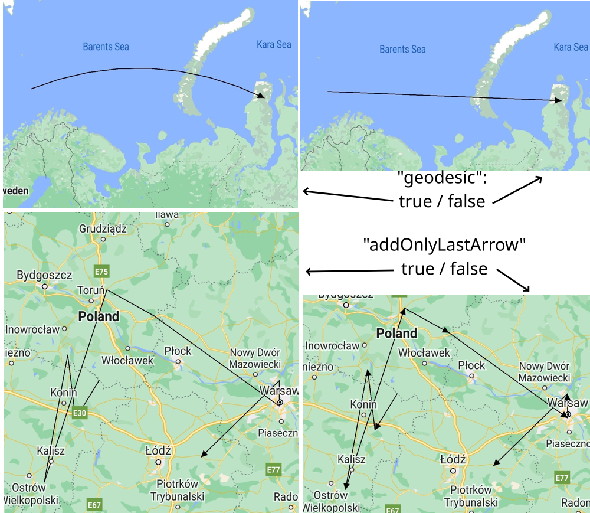

# React Native Maps Arrow Line

Add-on to react-native-maps to add arrow or any other component to the end of the Polyline component
Provides a workaround for [react-native-maps issue #3096](https://github.com/react-native-maps/react-native-maps/issues/3096)

Works both with **Expo-managed** and **bare** workflows.

## Installation

```
npm install react-native-map-maps-arrow-line react-native-maps --save
```

## Usage
Please refer to a working expo-manages app in /example folder.

1. Instead of built-in **Polyline** component of react-native-maps, import separate component:
```js
import ArrowedPolyline from 'react-native-maps-arrow-line';
```
2. Use the component the same way you would use **Polyline**:
```js
...
<MapView>
  {/* <Polyline coordinates={COORDINATES} /> - don't use this */}
  <ArrowedPolyline coordinates={COORDINATES} />
</MapView>
...
```

## Props
Inherits all the properties of **Polyline** component, as described [here](https://github.com/react-native-maps/react-native-maps/blob/master/docs/polyline.md).<br />
Has three own properties, all of them are optional:

 - **arrowSize**: number<br />
_default: 10_<br />
The size of an arrow pointer that will be used<br />

 - **addOnlyLastArrow**: boolean<br />
_default: false_<br />
By default, arrow pointers are drawn to all segments of the line. If set to _true_, the arrow pointer will be drawn only to the last segment of the polyline.<br />

 - **arrow**: ReactComponent<br />
_default: triangle composed of a **View** components_<br />
It is possible to use custom pointer. This should be a function returning React Component.<br />
Please note, if you use a custom component

## Examples

## Notes
1. Arrow is created by the **Marker** component, which is rotated to align with the line.
2. Calculation is based on spheric Earth form, which may result in slight angle aberration for some arrows which, however, should not be noticeable.
3. Arrows are drawn both for "geodesic" (shortest distance) and straight lines.